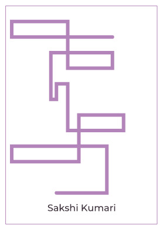
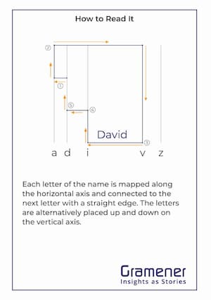

# Data comics workshop in Hyderabad

We, at Gramener, organized a [data comics workshop](https://www.meetup.com/meetup-group-EkjzkhLt/events/266798098/) at ISB on 14th December, 2019. The event was free for participants and was open for 75 slots.

I share our experience of organizing a one of the kind data events.

## Table of contents

- [Background](#background)
- [Workshop](#workshop)
  - [Part 1](#part-1)
  - [Part 2](#part-2)
    - [Classroom](#classroom)
    - [Genetic disorder](#genetic-disorder)
    - [Literacy disparity](#literacy-disparity)
- [Logistics](#logistics)
  - [Registrations](#registrations)
  - [Participants](#participants)
  - [Venue](#venue)
- [Volunteers](#volunteers)
  
## Background
To promote *data storytelling for business communication* within and outside the organization we started monthly data storytelling events first in Feb 2019 but became a regular practice from May to October (every second Friday of the month). Upon requests for a weekend event from the community we organized this workshop.

The focus of all our events is learning and not competition. Hence, we don't award participants for their work but encourage discussion with everyone around.

## Workshop
The workshop was carefully structured as follows:

| Session Title | What | By |
| ----- | ---- | -- |
| How to derive insights | What is an insight, how to find it | Bhasker Reddy |
| Insights through comics | Narrating insights using comics | Richie Lionell |
| Making comics | How to create characters, emotions, expressions, storyboarding. Output from this session is shared in [Part 1](#part-1) section below, | Ramya Mylavarapu |
| Comics on steroids | Interactive comics with Augmented Reality | Richie Lionell |
| Cant' draw? No problem! | Using [ComicGen](https://gramener.com/comicgen/) to create comics | Sunil Sharma |
| Hands-on | Participants analyzed one of the two shared datasets to create insights and narrate them as a story. Output presented in [Part 2](#part-2) section below. | Participants |

The sessions are geared towards people who are interested to narrate stories through comic form.

### Part 1
As *Ramya* taught participants about expressions, emotions, characters... they practiced along. At the end of the hour, participants were asked to create a character of their own choice.

### Part 2
In second half of the day, participants were given datasets to find insights and narrate a story on. They roughly had 2.5 hrs to do so. Below are some of the final submissions.

#### Classroom
This was a perfect example of how one could narrate a story (female child literacy). There are clear stakeholders (students... boys and girls, teachers), charts used as a teaching aid that take a story forward. Expressions of the characters vary from panel to panel capturing the intent of the narrated text. Camera angle varies in of the panels too.

#### Genetic disorder
This submission combined different data properties for a perfect narration: real images, news media relevancy, antenatal checks for pregnant women, literacy. Expressions of the characters vary from panel to panel with important text highlighted (numbers, indicators, diseases).

#### Literacy disparity
This submission is topical in talking about literacy disparity rate between men and women and highlight . 

#### 

## Logistics
### Registrations
For a capacity of 75 slots we were overbooked at 110. We did this accounting for a higher dropout rate (~30% from what I gather) for free events.

To ensure participants turned up we telephoned the registrants, emailed/SMSed those whom we couldn't reach out to. At the end of it we had 84 participants apart from 11 volunteers.

### Participants
The mix of participants was just right. We had people with different backgrounds: business, data analysts, students, data enthusiasts.

### Stickers, takeaways
We planned for three kinds of stickers/takeaways: one as a participant name tag, one as a takeaway, Gramener stickers. 

A data art was planned as a takeaway. Note the sample below:

Many people were curious to know how it was created. Thanks to Priti for making it! 

### Venue
ISB turned out to be perfect host for the event. The lecture hall had a great setup for multiple boards, audio-video, microphones, seats. It was more than what we requested for. Giri (from ISB) took great care of the setup and us.

## Volunteers
Organizing an external event is never easy and wouldn't be possible without all the volunteers who helped coordinate for logistics, food, printers, stickers, venue.

## References
1. Data storytellers [meetup page](https://www.meetup.com/meetup-group-EkjzkhLt/)
2. Data comics workshop @ Hyderabad [meetup page](https://www.meetup.com/meetup-group-EkjzkhLt/events/266798098/)
3. ComicGen [website](https://gramener.com/comicgen/)

