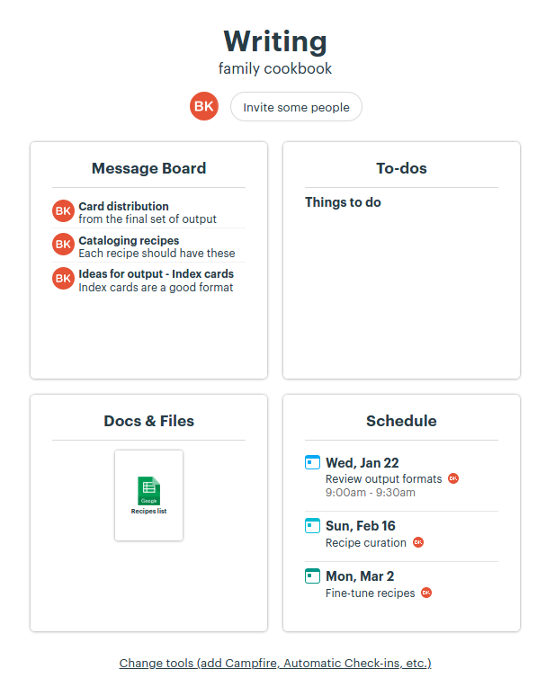

I'm taking off from work between Jan-Mar 2020 to focus on curating food recipes. The focus will be on the dishes made at home by my mother and grandmother (used to).

Learning from the masters of public learning ([swyx](https://www.swyx.io/writing/learn-in-public), [Julia Evans](https://jvns.ca/), [Amit Patel](https://www.redblobgames.com/)) I'll be sharing my progress publicly, periodically.

## Kicking it off
Basecamp (a project management software) now has a free option for [personal](https://basecamp.com/personal) use. It offers three projects and supports up to 20 users.

First thoughts, love its ease-of-use with a guided setup for first-time users!

## The plan
I'd expect to take 45-50 days to write down the recipes, cook all of them, fine-tune the recipes, invite friends and family over for parties. Simultaneously review output formats. Post writing the recipes I'll be spending the following three weeks to refine them.

I'm not yet sure on how the output will be although I know what it won't be surely (photographs). I'll be reading a lot on food, cooking styles, circumstances etc to write well.

In short the next three months would be nothing but celebration of food. This is my first instance of taking out time for an elaborate personal project. Wish me luck!
